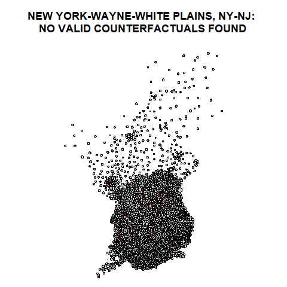

```{r global, include=FALSE}

# data and libraries for shiny widgets

library( flexdashboard )
library( tidyverse )
library( ggmap )
library( leaflet )
library( viridis )
library( shiny )
library( DT )
library( pander )
library( knitr )
library( rsconnect )


# data and libraries for matchit code

library( MatchIt )
library( here )
library( dplyr )
library( geojsonio )
library( sp )


```


```{r global, include=FALSE}

# Metro-matching code


## STEP 01

#Load a catalog of URLs of dorling cartograms for each CBSA metro area in the US. 

load_crosswalk <- function( )
{
   dorlings.url <- "https://raw.githubusercontent.com/meliapetersen/matching-project/master/data/cbsa-names-and-shapefiles.csv"
   dorlings.catalog <- read.csv( dorlings.url )
   return( dorlings.catalog )
}


#Load a dorling cartogram for one metro area: 

get_dorling <- function( cbsa, dorlings.catalog=NULL, mapit=FALSE )
{

   if( is.null(dorlings.catalog) ){ dorlings.catalog <- load_crosswalk() }


   file.name <- dorlings.catalog$shapefile[ dorlings.catalog$cbsa == cbsa ]
 

   base.url <- "https://raw.githubusercontent.com/DS4PS/usa-dorling-shapefiles/master/maps/metros-dorling/"

   full.url <- paste0( base.url, file.name )

   map <- geojsonio::geojson_read( x=full.url,  what="sp" )

   if( mapit ){ plot( map ) }

   return( map )
   
}

## STEP 02

#Load the New Market Tax Credit treatment data: 


df.treatment <- read.csv("rodeod-treatment-data.csv")
rmarkdown::paged_table(  head(df.treatment) )


#Add the treatment data to the dorling spatial object: 


add_treatment <- function( df.treatment, dorling.object )
{

  # merge leftjoin dorling object and treatment data
  dorling.object <- merge( dorling.object, df.treatment, by.x="GEOID", by.y="id2", all.x=TRUE )


  # create treatment variable 
  treatment <- dorling.object$treatment 
  
  # omit NAs
  treatment[ is.na(treatment) ] <- 0
  
  #add treatment variable back into df
  dorling.object$treatment <- treatment
 

  return( dorling.object )
}

## STEP 03

#Match the "treated" census tracts (those that received federal aid) with *equivalent* untreated tracts using the matchit package.


match_tracts <- function( fo, dorling.object )
{
   # extract data frame from sp object
   # rename rows using tract IDs
   
   df <- as.data.frame( dorling.object )
   row.names(df) <- df$GEOID
   
   # convert string to formula object
   fo <- as.formula( fo )
   
   matchit.object <- NULL

   # find matches in dataframe based on Household income, college education, and whiteness 
   try( 
      
      invisible({ capture.output({ 
         
      matchit.object <- matchit( fo, 
                        method="genetic", discard="both", reestimate=TRUE,
                        replace=FALSE, caliper=.25, data = df )
      })  }),
      
      
      silent=TRUE )

   return( matchit.object )

}

```


US Metro Matching Tool - NMTC Example (Start here)
=====================================  

Inputs {.sidebar}
-------------------------------------

```{r}

# Radio button to choose city

  radioButtons("radio", label = h3("Cities"),
    choices = list("Phoenix, AZ" = "phoenix.png" , "Boulder, CO" = "boulder.png", "New Orleans, LA" = "new.orleans.png", "Reno, NV" = "reno.png", "New York, NY" = "new-york.png" ), 
    selected = "New York, NY")


```

Outputs
-------------------------------------

### Neighborhood Matches by Census Data 


```{r, echo=FALSE, fig.cap="A caption", out.width = '100%'}
#knitr::include_graphics( input$radio )


 renderImage({  })


```   

Program Data Upload 
=====================================  

Inputs {.sidebar}
-------------------------------------

```{r}

# File upload pseudocode 
fileInput(inputId, label, multiple = FALSE, accept = NULL)

# Run button pseudocode 
actionButton(inputId, label, icon = NULL)

#Head data to show merged and cleaned 

```

   
Outputs
-------------------------------------

### 


```{r}

# File upload pseudocode
function(input, output) {

  # You can access the value of the widget with input$file, e.g.
  output$value <- renderPrint({
    str(input$file)
  })

}

# Run button pseudocode 
function(input, output) {

  # You can access the value of the widget with input$action, e.g.
  output$value <- renderPrint({ input$action })

}

# data headed 
```   

Matching Analysis
=====================================  

Inputs {.sidebar}
-------------------------------------

```{r}

#Checkbox for Demographic Variables

checkboxGroupInput("demographicCheckBox", label = h3("Census Demographic Variables"), 
    choices = list("Unemployment"    = "unemp00", 
                   "College Educated"   = "col00", 
                   "Household Income" = "hinc00", 
                   "Median Home Value"  = "mhmval00",
                   "Total families"    = "family00",
                   "Female Headed Households"  = "fhh00"),
                   
    selected = c("unemp00", "col00"))


 
# Run button pseudocode 
actionButton(inputId, label, icon = NULL)

# Download CSV button pseudocode 
actionButton(inputId, label, icon = NULL)

```

   
Outputs
-------------------------------------

### 


```{r}

# matched data analysis 

# Run button pseudocode 
function(input, output) {

  # You can access the value of the widget with input$action, e.g.
  output$value <- renderPrint({ input$action })

}

# Download CSV button pseudocode 
function(input, output) {

  # You can access the value of the widget with input$action, e.g.
  output$value <- renderPrint({ input$action })

}
```   

Maps Matched by Census Tract
=====================================  

Inputs {.sidebar}
-------------------------------------

```{r}
#dropdown for metro areas that matches were analyzed by 

# City dropdown menu pseudocode 
selectInput(inputId, label, choices, selected = NULL, multiple = FALSE, selectize = TRUE)

# Run button pseudocode 
actionButton(inputId, label, icon = NULL)

##If everything is perfect, create checkbox option for census variable to create cloropleth map for comparison 
    ## Will be radio button to decide between cloropleth map or matches map 
    ## Also option to show maps side by side for analysis 

# download shapefile "data" button pseudocode 
actionButton(inputId, label, icon = NULL)

```

   
Outputs
-------------------------------------

### 


```{r}

#City dropdown menu pseudocode 

function(input, output) {

  # You can access the value of the widget with input$select, e.g.
  output$value <- renderPrint({ input$select })

}

# Run button pseudocode 
function(input, output) {

  # You can access the value of the widget with input$action, e.g.
  output$value <- renderPrint({ input$action })

}

# Shapefile matched map shown here 
# (render shapefile)

# downloadable html shapefile catalog
# Run button pseudocode 
function(input, output) {

  # You can access the value of the widget with input$action, e.g.
  output$value <- renderPrint({ input$action })

}

```   


Executive Summary 
===================================== 


Row 
-------------------------------------

### About this Dashboard 

Data from: XXX

This dashboard uses... 

### Dashboard Author

Melia Petersen, Melia.Petersen@asu.edu, Tempe, AZ
Jaesa Rogers, Jaesa.Rogers@asu.edu, Tempe, AZ 

Row
-------------------------------------

DATA DICTIONARY 


```{r}
URL.dd <- "https://raw.githubusercontent.com/DS4PS/cpp-526-fall-2019/master/labs/final-project/TempeTrafficAccidentsDataDictionary.csv"
data.dictionary <- read.csv( URL.dd, stringsAsFactors=F )

data.dictionary$description <- stringi::stri_trans_general( data.dictionary$description, "latin-ascii" )
data.dictionary %>%
  select( column, description ) %>%
  pander( )
```


Data
=====================================  

```{r}
# library( DT )

these.buttons <- c( 'copy', 'csv', 'pdf', 'print' )

renderDataTable({
  datatable(dat[1:100,], filter='bottom', rownames=FALSE, 
           #options=list( pageLength=5, autoWidth=TRUE ),
           fillContainer=TRUE, 
           style="bootstrap",
           class='table-condensed table-striped',
           extensions = 'Buttons', 
           options=list( dom='Bfrtip', 
                         buttons=these.buttons  ) )
})
```
